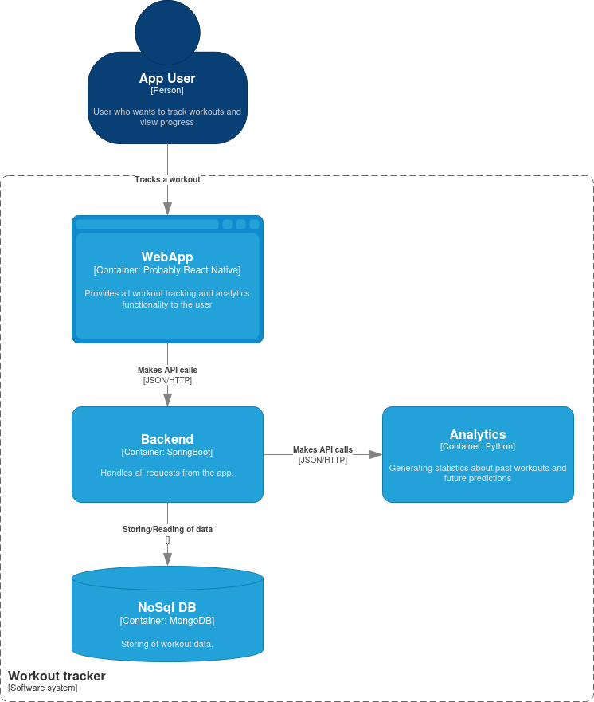
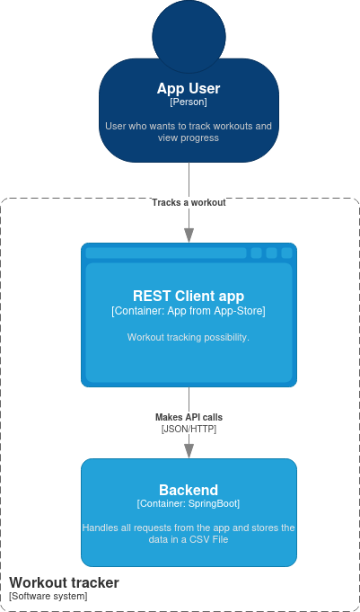

# Workout Tracker

## Architecture

### Target architecture

### MVP Architecture
To get started quickly, a MVP architecture should contain only the most basic
components required to make the app useful, without yet thinking about
a proper storage or analytics component.
Therefore, the database and analytics components will be fully ignored at the moment. 
Priority is all about being able to send the workout data from the phone, 
recorded with the timer app, to the server. Storing of the data will be done in json files.
